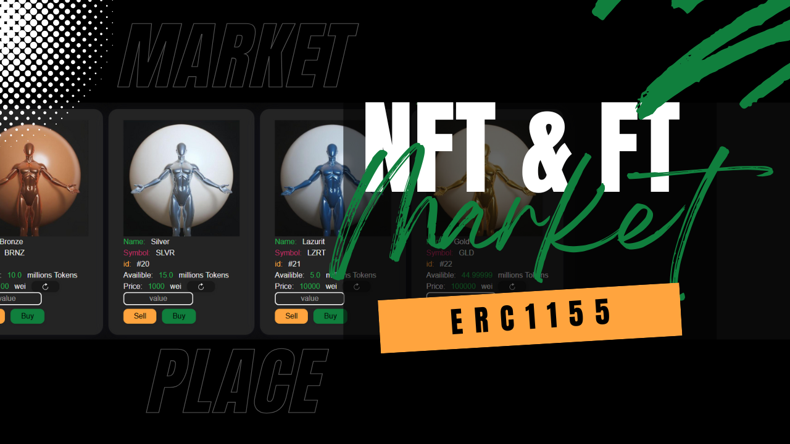

# ERC1155-NFT Marketplace

---

## 🚀 Overview

Welcome!  
This repository contains a full-featured NFT & FT marketplace built on the ERC1155 standard.

- **Multi-asset support:** Buy, sell, and exchange both NFTs and fungible tokens (FTs) in one place.
- **Fair queue mechanism:** Ensures a transparent, owner-independent FT token exchange.
- **Security-first:** Only approve tokens you actually sell. Contract owner never has access to your assets.
- **Decentralized:** Metadata is stored on IPFS.
- **Upgradable:** Marketplace contract uses proxy pattern for seamless upgrades.

Try the live app on [Vercel](https://erc-1155-nft-market-place.vercel.app/)  
Explore the [source code](https://github.com/FNuzhdin/ERC1155-NFT-MarketPlace)  
Watch the [video presentation](https://youtu.be/wH5yvg_A_BQ)

---

## 🎥 Video Preview

Click the preview image above or [watch on YouTube](https://youtu.be/wH5yvg_A_BQ).

---

## 📦 Features

- **NFT Marketplace:** Mint, list, buy, and sell NFTs.
- **FT Token Exchange:** Mint, list, and exchange fungible tokens with a fair queue mechanism.
- **No setApprovalForAll needed:** Approve only the tokens you sell.
- **Instant listing:** To sell, simply send tokens to the marketplace. NFTs: set your price. FTs: join the queue automatically.
- **Liquidity reserve:** Owner’s tokens are always last in the sale queue, providing liquidity but never front-running users.
- **Admin panel:** If you’re the contract owner, access special features (minting, pausing, etc).
- **Decentralized metadata:** All token data is stored via IPFS/Pinata.
- **Upgradable contracts:** Marketplace uses OpenZeppelin upgradable proxy pattern.
- **Pause mode:** Token contract can be paused for maintenance or emergencies.

---

## ⚙️ Technical stack

| Category                      | Technologies / Tools                              | Description / Purpose                                       |
| ----------------------------- | ------------------------------------------------- | ----------------------------------------------------------- |
| **Frontend**                  | Next.js (App Router)                              | SSR/SPA framework, routing                                  |
|                               | React 19                                          | UI library                                                  |
|                               | TypeScript                                        | Static typing                                               |
|                               | Wagmi                                             | Web3 hooks, Ethereum interaction                            |
|                               | ethers.js                                         | Ethereum JS/TS library                                      |
|                               | viem                                              | Type-safe web3 operations                                   |
|                               | @tanstack/react-query                             | Async data fetching, caching                                |
|                               | Pinata/IPFS                                       | Decentralized storage for metadata and files                |
|                               | React Icons                                       | UI icon library                                             |
|                               | JSDoc                                             | Code documentation (JS/TS)                                  |
|                               | Markdown                                          | Docs, README, code docs                                     |
| **Backend / Smart Contracts** | Hardhat                                           | Smart contract development and testing framework            |
|                               | Solidity                                          | Smart contract language                                     |
|                               | OpenZeppelin (incl. upgradeable/proxy)            | Secure base contracts and upgrade patterns                  |
|                               | dotenv                                            | Environment variable management                             |
|                               | ethers.js                                         | Ethereum scripting/testing                                  |
|                               | chai/mocha (via @nomicfoundation/hardhat-toolbox) | Contract testing                                            |
|                               | Etherscan API                                     | Contract verification                                       |
|                               | Alchemy                                           | Ethereum RPC provider                                       |
|                               | NatSpec                                           | Solidity function documentation                             |
| **DevOps / Automation**       | .env                                              | Store private/secrets/environment variables                 |
|                               | ABI/address automation                            | Sync ABI and addresses after deployment                     |
|                               | Documentation in README and JSDoc/Markdown        | Complete developer documentation                            |
|                               | Vercel                                            | Frontend deployment, hosting, and serverless infrastructure |

---

## 📝 Documentation

- [Frontend README](./front/README.md)
- [Frontend code & JSDoc](./front)
- [Contracts README](./contracts/README.md)
- [Contracts documentation (NatSpec)](./contracts)
- [Deployment/test scripts](./scripts)
- [Sepolia contract addresses & deployment info](./front/public/SepoliaDeployingData.json)

---

## 🧑‍💻 Quick Start

1. **Clone the repo:**  
   `git clone https://github.com/FNuzhdin/ERC1155-NFT-MarketPlace.git`
2. **Install dependencies:**  
   `cd front && npm install`
3. **Run frontend locally:**  
   `npm run dev`
4. **Explore contracts and scripts:**  
   See `/contracts` and `/scripts` folders.

---

## 🤝 Contributing & Feedback

Questions, feedback, or ideas for collaboration?  
Feel free to [open an issue](https://github.com/FNuzhdin/ERC1155-NFT-MarketPlace/issues) or contact me directly.

---

**Explore. Build. Exchange. Decentralize.**